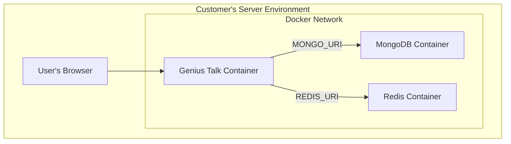
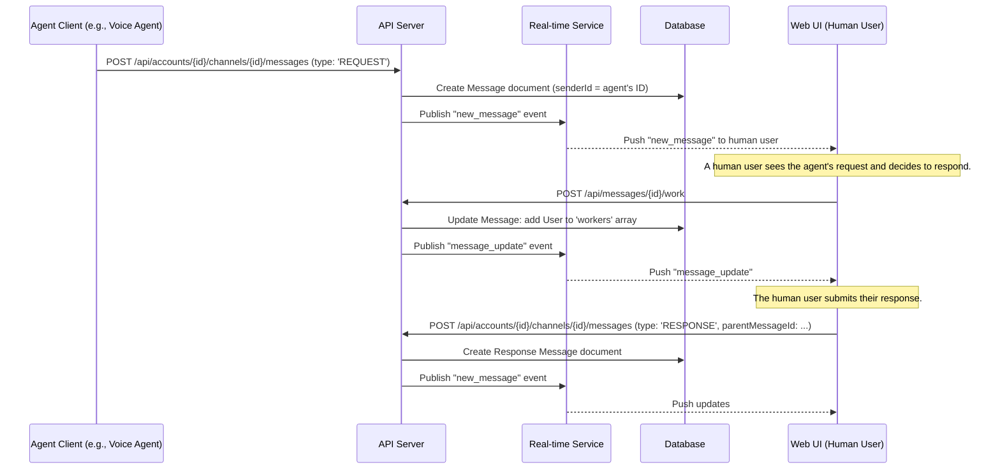

# Genius Talk Fullstack Architecture Document

## Introduction

This document outlines the complete fullstack architecture for Genius Talk, including backend systems, frontend implementation, and their integration. It serves as the single source of truth for AI-driven development, ensuring consistency across the entire technology stack.

This unified approach combines what would traditionally be separate backend and frontend architecture documents, streamlining the development process for modern fullstack applications where these concerns are increasingly intertwined.

## High Level Architecture

### Technical Summary

The proposed architecture for Genius Talk is a modern, full-stack application built for portability and scalability using containerization. The application is packaged as a Docker container, enabling consistent deployment in both our cloud (SaaS) environment and on a customer's local infrastructure.

The frontend is a responsive web application built with Next.js and shadcn/ui. The backend leverages Next.js API routes, with data persisted in MongoDB and real-time communication facilitated by Redis Pub/Sub. The entire system is designed with an API-first, stateless approach, where both user and agent authentication are handled via bearer tokens issued by the integrated BetterAuth framework.

### Platform and Infrastructure Choice

To support both cloud and on-premise deployments, the architecture is centered around Docker containers.

*   **Application Hosting:**
    *   **Cloud:** The application container will be deployed to a managed container service like **AWS Fargate** or **Google Cloud Run**.
    *   **On-Premise:** Customers will run the container using **Docker Compose** for single-server setups or a **Helm Chart** for Kubernetes.
*   **Database:** MongoDB (self-hosted via Docker for on-prem, or MongoDB Atlas for cloud).
*   **Cache & Pub/Sub:** Redis (self-hosted via Docker for on-prem, or a managed service for cloud).

### Repository Structure

A monorepo structure managed with npm workspaces is the ideal choice for this project.

*   **Structure:** Monorepo
*   **Monorepo Tool:** npm workspaces
*   **Package Organization:**
    *   `apps/web`: The main Next.js application (UI and API).
    *   `packages/shared`: Shared TypeScript types and constants.
    *   `packages/config`: Shared configurations (ESLint, TypeScript).

### High Level Architecture Diagram (On-Premise View)



### Architectural Patterns

*   **Containerization:** The entire application is packaged in a Docker container for maximum portability.
*   **API-First Design:** The backend API is the core of the application, serving all clients (web UI, agents) via a consistent interface.
*   **Stateless API:** The API is stateless, with every request authenticated via a bearer token. This simplifies scaling and caching.
*   **Repository Pattern:** The backend uses the repository pattern to abstract database logic, improving testability and maintainability.

## Tech Stack

| Category | Technology | Version | Purpose | Rationale |
| :--- | :--- | :--- | :--- | :--- |
| **Frontend Language** | TypeScript | latest | Language for UI development | Provides type safety and better developer experience for large applications. |
| **Frontend Framework** | Next.js | latest | UI framework and rendering engine | Specified in PRD. Enables React-based development with server-side rendering and static site generation. |
| **UI Component Library**| shadcn/ui | latest | Pre-built, accessible UI components | Specified in UI/UX Spec. Accelerates development with customizable and accessible components. |
| **State Management** | Zustand | latest | Global state management for React | A lightweight, unopinionated state management solution that is easy to use with Next.js. |
| **Backend Language** | TypeScript | latest | Language for API development | Consistent language across the stack simplifies development and code sharing. |
| **Backend Framework** | Next.js API Routes | latest | Backend API framework | Specified in PRD. Co-locates backend logic with the frontend, simplifying the monorepo structure. |
| **API Style** | REST | N/A | API design paradigm | A well-understood, standard approach for building APIs. Aligns with API-first goal. |
| **Database** | MongoDB | 5.0+ | Primary data storage | Specified in PRD. A flexible NoSQL database that works well with JavaScript-based applications. |
| **Cache** | Redis | 7.0+ | Caching and real-time messaging | Specified in PRD. Used for caching frequently accessed data and as a pub/sub broker for WebSockets. |
| **File Storage** | N/A | N/A | Storing user-uploaded files | Out of scope for MVP. Future implementation would use a service like AWS S3 or MinIO for on-premise. |
| **Authentication** | BetterAuth | latest | Centralized User and Agent Authentication | External service providing robust authentication flows and token validation. Integrated via server-side library.
| **Frontend Testing** | Jest & React Testing Library | latest | Unit and component testing | Industry standard for testing React applications, ensuring component correctness. |
| **Backend Testing** | Jest & Supertest | latest | API endpoint testing | Allows for testing API routes without needing a running server, ideal for CI environments. |
| **E2E Testing** | Playwright | latest | End-to-end browser testing | A modern, reliable E2E testing framework that supports all major browsers. |
| **Build Tool** | Docker | latest | Containerization | Packages the application and its dependencies into a portable image for both cloud and on-premise deployments. |
| **Bundler** | SWC (via Next.js) | latest | JavaScript/TypeScript bundler | The default, high-performance bundler included with Next.js. |
| **IaC Tool** | Docker Compose & Helm | latest | Infrastructure as Code | Docker Compose for simple on-prem setups, Helm for Kubernetes-based deployments (both on-prem and cloud). |
| **CI/CD** | GitHub Actions | N/A | Continuous Integration/Deployment | Specified in PRD. Automates the build, test, and deployment pipeline. |
| **Monitoring** | Prometheus & Grafana | latest | On-premise monitoring | A standard open-source stack for metrics and visualization, suitable for self-hosted deployments. |
| **Logging** | Console (stdout) | N/A | Application logging | Directing logs to stdout is a container best practice, allowing flexible log collection by different platforms. |
| **CSS Framework** | Tailwind CSS | latest | Utility-first CSS framework | Specified in UI/UX Spec. Enables rapid UI development with a consistent design system. |

## Data Models

### Account Model
*   **Purpose:** Represents a single customer or tenant, acting as the primary container for all their data.
*   **TypeScript Interface:**
    ```typescript
    interface Account {
      accountId: string;
      name: string;
    }
    ```

### User Model
*   **Purpose:** Represents a human participant. A user can belong to multiple accounts.
*   **TypeScript Interface:**
    ```typescript
    interface AccountMember {
      accountId: string;
      role: 'admin' | 'member';
    }

    interface User {
      userId: string;
      email: string;
      name: string;
      accounts: AccountMember[];
    }
    ```

### Agent Model
*   **Purpose:** Represents an AI participant, owned by a single account.
*   **TypeScript Interface:**
    ```typescript
    interface Agent {
      agentId: string;
      accountId: string;
      name: string;
      betterAuthTokenHash: string; // Hashed token provided by BetterAuth for agent authentication
    }
    ```

### User Model
*   **Purpose:** Represents a human participant. A user can belong to multiple accounts. User identities are managed by BetterAuth, and only essential user data is stored locally.

### Channel Model
*   **Purpose:** Represents a conversation space, owned by a single account.
*   **TypeScript Interface:**
    ```typescript
    interface Channel {
      channelId: string;
      accountId: string;
      name: string;
      isPublic: boolean;
      members: (User['userId'] | Agent['agentId'])[];
    }
    ```

### Message Model
*   **Purpose:** Represents a single communication unit, designed to support the collaborative request/response workflow.
*   **TypeScript Interface:**
    ```typescript
    type MessageType = 'GENERAL' | 'REQUEST' | 'RESPONSE';

    interface Worker {
      workerId: User['userId'] | Agent['agentId'];
      startedAt: Date;
    }

    interface Message {
      messageId: string;
      channelId: Channel['channelId'];
      senderId: User['userId'] | Agent['agentId'];
      content: string;
      type: MessageType;
      parentMessageId?: Message['messageId'];
      workers?: Worker[]; // Only for messages of type 'REQUEST'
      createdAt: Date;
    }
    ```

## API Specification

The API is a RESTful service with all endpoints scoped by `accountId` to ensure multi-tenancy. Authentication is handled via a bearer token on every request.

*   **Specification:** `docs/openapi.yaml` (A full OpenAPI 3.0 spec will be maintained here)
*   **Example Endpoints:**
    *   `GET /api/accounts/{accountId}/channels`
    *   `POST /api/accounts/{accountId}/channels/{channelId}/messages`
    *   `POST /api/accounts/{accountId}/agents`
*   **Authentication:** All requests must include an `Authorization: Bearer <token>` header with a valid API key from BetterAuth, validated by the `@better-auth/server-side-library`.

## Components

| Component | Responsibility | Technology Stack |
| :--- | :--- | :--- |
| **Web UI** | Renders all screens, handles user input, manages client-side state. | Next.js, React, shadcn/ui, Zustand |
| **API Server** | Handles all business logic, data persistence, and security. | Next.js API Routes, TypeScript |
| **Real-time Service** | Manages WebSockets and broadcasts real-time events via Redis Pub/Sub. | Node.js, ws, Redis |
| **Database** | Provides persistent storage for all application data. | MongoDB |
| **Cache & Pub/Sub** | Provides in-memory caching and the message broker for real-time events. | Redis |

## External APIs

The application has one critical external dependency.

### BetterAuth Authentication Service
*   **Purpose:** To provide a centralized and secure way to handle user and agent authentication and authorization. It acts as the authoritative source for user and agent identities and their authentication status.
*   **Documentation:** `https://www.better-auth.com/docs/introduction` (Note: Detailed API and integration documentation is required for full understanding and is currently being researched.)
*   **Integration:** The Genius Talk backend uses the `@better-auth/server-side-library` to validate incoming bearer tokens for both users and agents. The frontend uses the client-side library to manage user login flows and token acquisition. This library is a critical external dependency.

## Core Workflows

### Agent-Initiated Request Workflow

This diagram shows the symmetrical nature of the system, where an AI agent can initiate a request that a human user then responds to.



## Database Schema

The database is designed for multi-tenancy, with all collections indexed by `accountId`.

*   **`accounts`:** Stores tenant information.
*   **`users`:** Stores user profiles, with a list of accounts each user belongs to.
*   **`agents`:** Stores AI agent configurations, scoped to an account.
*   **`channels`:** Stores conversation channels, scoped to an account.
*   **`messages`:** Stores all messages. This is the primary collection, with compound indexes on `(accountId, channelId, createdAt)` for performance and a text index on `content` for search.

## Frontend Architecture

*   **Component Organization:** Components are organized by feature in `src/components`.
*   **State Management:** Global state is managed with **Zustand**, organized into slices (e.g., `sessionSlice`, `channelSlice`).
*   **Routing:** Next.js file-system routing is used, with route groups for organization and a layout-based guard for protected routes.
*   **Services Layer:** A services layer (`src/services`) abstracts all API communication, providing a clean interface for UI components.

## Backend Architecture

*   **Service Architecture:** A serverless approach using **Next.js API Routes**. Each endpoint is a self-contained function.
*   **Database Architecture:** We use **Mongoose** to define schemas and the **Repository Pattern** to abstract all database logic from API handlers.
*   **Authentication:** A middleware guard, `auth()`, is called on every API route to validate the BetterAuth bearer token. This middleware leverages the `@better-auth/server-side-library` to perform token validation against the BetterAuth service, ensuring secure access to API endpoints for both human users and AI agents.

## Unified Project Structure

The project is a monorepo managed with npm workspaces.

```plaintext
genius-talk/
├── apps/
│   └── web/            # The Next.js application (UI & API)
├── packages/
│   ├── shared/         # Shared TypeScript types
│   └── config/         # Shared configurations (ESLint, etc.)
├── infrastructure/     # On-prem deployment artifacts (Docker Compose, Helm)
├── docs/               # Project documentation
└── package.json        # Root package.json
```

## Development Workflow

*   **Setup:** `npm install` at the root. `docker-compose up` to start local DB/cache.
*   **Run:** `npm run dev --workspace=web` from the root.
*   **Configuration:** All configuration is managed via a root `.env` file.

## Deployment Architecture

*   **Artifact:** A single **Docker image** is built for all environments.
*   **Registry:** The image is pushed to the **GitHub Container Registry (GHCR)**.
*   **Cloud:** Deployed to a managed container service like **AWS Fargate**.
*   **On-Premise:** Deployed via **Docker Compose** or a **Helm chart**.
*   **CI/CD:** A GitHub Actions workflow automates building, testing, and deploying to the cloud or packaging for on-premise releases.

## Security and Performance

*   **Security:**
    *   All endpoints are protected via token authentication provided by the BetterAuth framework, ensuring secure access control for both users and agents.
    *   Input validation is enforced with `zod`.
    *   Secrets are managed via environment variables.
    *   A strict Content Security Policy (CSP) is used on the frontend.
*   **Performance:**
    *   **Frontend:** Aims for <250KB initial bundle size, leveraging Next.js features like code splitting and SSR.
    *   **Backend:** Aims for <200ms average API response time, using database indexing and Redis caching.
