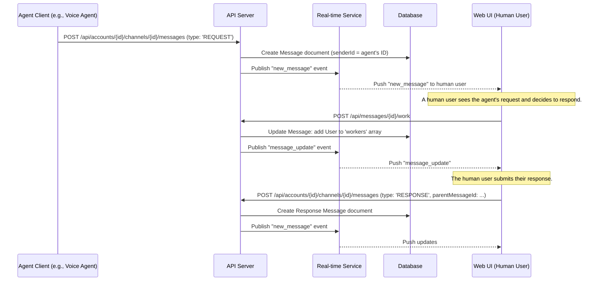

# Core Workflows

## Agent-Initiated Request Workflow

This diagram shows the symmetrical nature of the system, where an AI agent can initiate a request that a human user then responds to.

```mermaid
sequenceDiagram
    participant AgentClient as Agent Client (e.g., Voice Agent)
    participant APIServer as API Server
    participant RealtimeSvc as Real-time Service
    participant Database as Database
    participant WebUI as Web UI (Human User)

    AgentClient->>APIServer: POST /api/accounts/{id}/channels/{id}/messages (type: 'REQUEST')
    APIServer->>Database: Create Message document (senderId = agent's ID)
    APIServer->>RealtimeSvc: Publish "new_message" event
    RealtimeSvc-->>WebUI: Push "new_message" to human user

    Note over WebUI: A human user sees the agent's request and decides to respond.
    WebUI->>APIServer: POST /api/messages/{id}/work
    APIServer->>Database: Update Message: add User to 'workers' array
    APIServer->>RealtimeSvc: Publish "message_update" event
    RealtimeSvc-->>WebUI: Push "message_update"

    Note over WebUI: The human user submits their response.
    WebUI->>APIServer: POST /api/accounts/{id}/channels/{id}/messages (type: 'RESPONSE', parentMessageId: ...)
    APIServer->>Database: Create Response Message document
    APIServer->>RealtimeSvc: Publish "new_message" event
    RealtimeSvc-->>WebUI: Push updates
```
