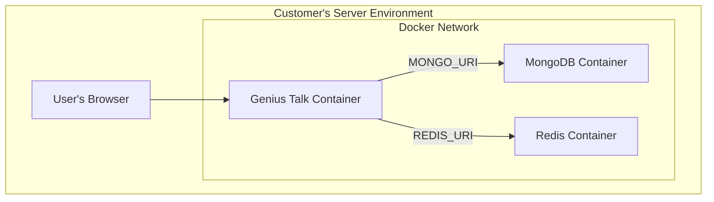

# High Level Architecture

## Technical Summary

The proposed architecture for Genius Talk is a modern, full-stack application built for portability and scalability using containerization. The application is packaged as a Docker container, enabling consistent deployment in both our cloud (SaaS) environment and on a customer's local infrastructure.

The frontend is a responsive web application built with Next.js and shadcn/ui. The backend leverages Next.js API routes, with data persisted in MongoDB and real-time communication facilitated by Redis Pub/Sub. The entire system is designed with an API-first, stateless approach, where both user and agent authentication are handled via bearer tokens issued by the integrated BetterAuth framework.

## Platform and Infrastructure Choice

To support both cloud and on-premise deployments, the architecture is centered around Docker containers.

*   **Application Hosting:**
    *   **Cloud:** The application container will be deployed to a managed container service like **AWS Fargate** or **Google Cloud Run**.
    *   **On-Premise:** Customers will run the container using **Docker Compose** for single-server setups or a **Helm Chart** for Kubernetes.
*   **Database:** MongoDB (self-hosted via Docker for on-prem, or MongoDB Atlas for cloud).
*   **Cache & Pub/Sub:** Redis (self-hosted via Docker for on-prem, or a managed service for cloud).

## Repository Structure

A monorepo structure managed with npm workspaces is the ideal choice for this project.

*   **Structure:** Monorepo
*   **Monorepo Tool:** npm workspaces
*   **Package Organization:**
    *   `apps/web`: The main Next.js application (UI and API).
    *   `packages/shared`: Shared TypeScript types and constants.
    *   `packages/config`: Shared configurations (ESLint, TypeScript).

## High Level Architecture Diagram (On-Premise View)

## Architectural Patterns

*   **Containerization:** The entire application is packaged in a Docker container for maximum portability.
*   **API-First Design:** The backend API is the core of the application, serving all clients (web UI, agents) via a consistent interface.
*   **Stateless API:** The API is stateless, with every request authenticated via a bearer token. This simplifies scaling and caching.
*   **Repository Pattern:** The backend uses the repository pattern to abstract database logic, improving testability and maintainability.
