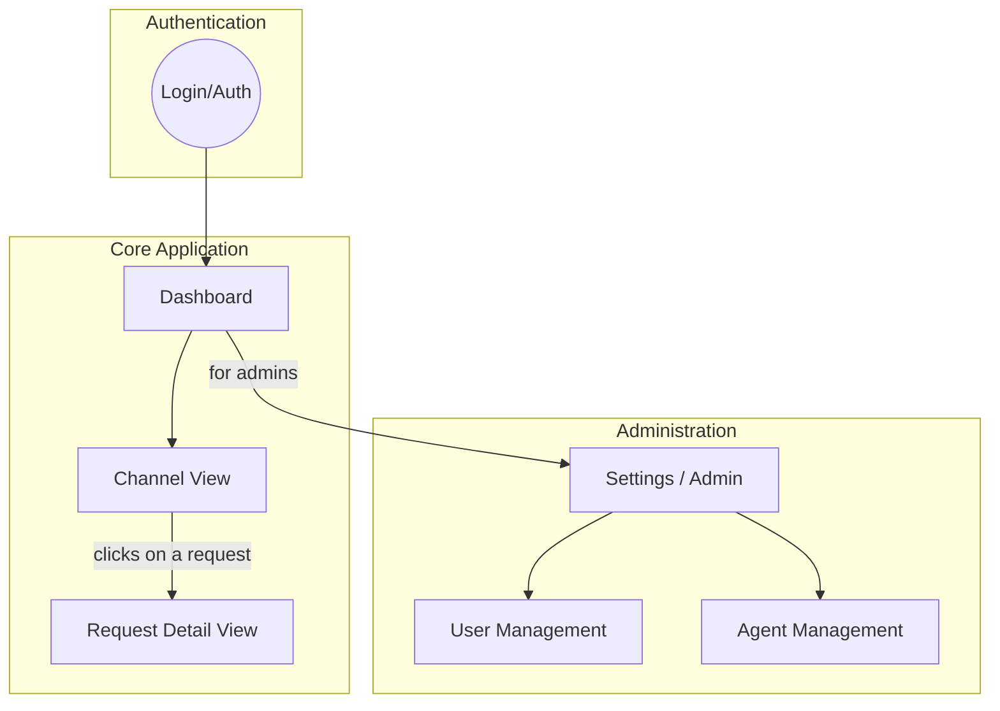
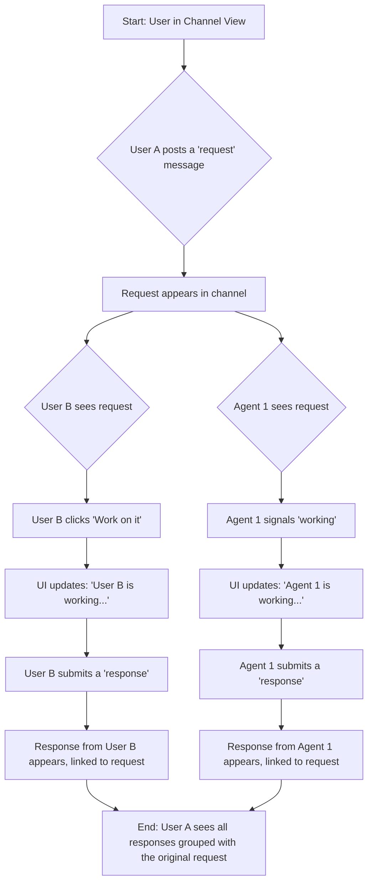
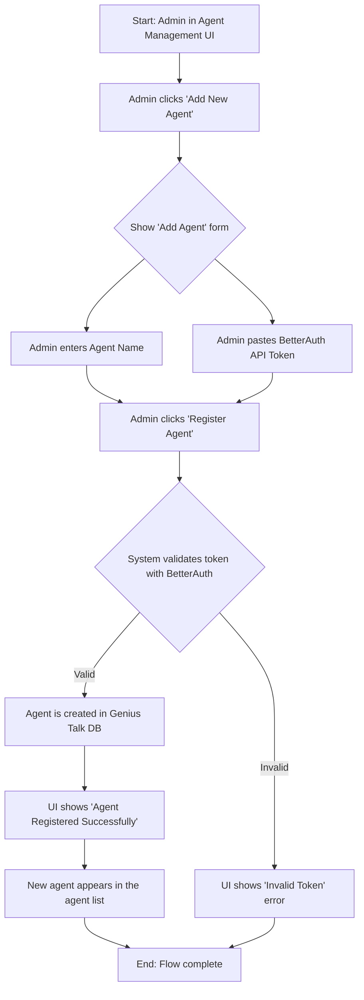

# Genius Talk UI/UX Specification

## Introduction
This document defines the user experience goals, information architecture, user flows, and visual design specifications for Genius Talk's user interface. It serves as the foundation for visual design and frontend development, ensuring a cohesive and user-centered experience.

### Overall UX Goals & Principles

#### Target User Personas
*   **Collaborator:** The primary day-to-day user. They need to participate in conversations, make requests, and understand the status of their work in a clear, efficient manner.
*   **Administrator:** The system manager. They are focused on managing users and agents, configuring channels, and ensuring the platform runs smoothly.
*   **Developer / Integrator:** A technical user. They are responsible for integrating new AI agents with the Genius Talk platform, requiring robust API documentation and a developer-centric experience.

#### Usability Goals
*   **Clarity:** The UI must present complex, multi-participant conversations clearly, making it easy to track who is doing what.
*   **Efficiency:** Core tasks like making a request, viewing responses, and managing agents should be streamlined and require minimal effort.
*   **Learnability:** New users should be able to quickly understand the platform's core concepts and start collaborating with minimal guidance.

#### Design Principles
1.  **Clarity and Efficiency First:** The interface must be clear, intuitive, and optimized for developer workflows, prioritizing function over ornamentation.
2.  **Real-time Collaboration:** The UI should feel alive, reflecting the real-time nature of conversations and agent activities through instant updates.
3.  **Progressive Disclosure:** Provide high-level overviews (Dashboard, Channel View) and allow users to drill down for detailed information (Request Detail View) when needed.
4.  **Accessibility by Default:** Adhere to WCAG 2.1 AA standards to ensure the application is usable by everyone.
5.  **Minimalist Aesthetic:** Employ a professional, minimalist design with a simple, tech-oriented color palette to enhance readability and focus.

### Change Log

| Date | Version | Description | Author |
| :--- | :--- | :--- | :--- |
| 2025-08-05 | 1.0 | Initial draft of the UI/UX Specification. | Sally |

## Information Architecture (IA)

#### Site Map / Screen Inventory

#### Navigation Structure

*   **Primary Navigation:** A persistent top navigation bar will contain links to the **Dashboard** and **Channels**. For users with administrative privileges, a link to the **Settings / Admin** area will also be visible.
*   **Secondary Navigation:**
    *   Within the main application, a sidebar will list all public and private channels the user has access to, allowing them to switch between conversations.
    *   Within the **Settings / Admin** area, the secondary navigation will switch to "User Management" and "Agent Management".
*   **Breadcrumb Strategy:** Breadcrumbs will be used to show the user's current location and allow for easy navigation back to parent screens. For example: `Dashboard > [Channel Name] > Request: [Request ID]`.

## User Flows

#### Flow: Collaborative Request and Response

**User Goal:** To get the best possible answer to a request by allowing multiple participants (humans and AI) to respond, and to have full visibility into the process.

**Entry Points:** The user in Channel View.

**Success Criteria:** The user can see who is actively working on their request and can view all submitted responses, which are clearly grouped with the original request message.

**Flow Diagram:**

**Edge Cases & Error Handling:**
*   **No Response:** If no participant responds to a request within a configurable time, the request could be flagged as "unanswered."
*   **Participant Abandons Work:** If a participant signals they are working but doesn't respond, their "working on it" status could time out.
*   **Request Cancellation:** The original requester should have a way to cancel or close their request, which would prevent further responses.

#### Flow: Agent Registration

**User Goal:** As an administrator, to securely register a new AI agent in Genius Talk using a BetterAuth API token so it can participate in conversations.

**Entry Points:** The administrator is in the "Agent Management" screen.

**Success Criteria:** A new agent is successfully registered in the system, and its identity can be validated for future API requests.

**Flow Diagram:**

**Edge Cases & Error Handling:**
*   **Invalid Token:** The system must provide clear feedback if the BetterAuth token is expired, invalid, or lacks the necessary permissions.
*   **Duplicate Agent Name:** The system should prevent the creation of agents with duplicate names.
*   **Network Failure:** If the system cannot reach the BetterAuth service to validate the token, it should display an appropriate error message.

## Wireframes & Mockups

**Primary Design Files:** High-fidelity mockups and interactive prototypes will be created and maintained in Figma. A link to the Figma project will be added here once it's initiated.

#### Key Screen Layouts

**Screen: Dashboard**
*   **Purpose:** To provide a high-level, real-time overview of all activity across the platform.
*   **Key Elements:**
    *   **Metrics Bar:** Key stats like "Active Conversations," "Agents Online," and "Open Requests."
    *   **Real-time Activity Feed:** A central column showing a chronological stream of important events (new requests, critical alerts, new channels).
    *   **My Assignments:** A dedicated pod showing requests assigned directly to the user or that they are actively working on.
*   **Interaction Notes:** The activity feed should update in real-time. Each item in the feed should be clickable, navigating the user to the relevant channel or request.

**Screen: Channel View**
*   **Purpose:** The primary interface for participating in conversations within a specific channel.
*   **Key Elements:**
    *   **Channel Header:** Displays the channel name and a list of participants.
    *   **Message Display Area:** The main view showing the conversation history. Messages should be clearly attributed to the sender (with avatar/icon) and timestamped.
    *   **Message Input Box:** A rich text input at the bottom for composing messages, with controls to specify message type (General, Request, Instruction).
    *   **Request/Response Grouping:** Requests and their corresponding responses must be visually grouped together to maintain context.
*   **Interaction Notes:** New messages should appear in real-time. Users should be able to scroll up to load older messages.

**Screen: Request Detail View**
*   **Purpose:** A focused view to drill down into a single request and all its associated activity.
*   **Key Elements:**
    *   **Original Request:** The initial request message is prominently displayed at the top.
    *   **Status Tracker:** A visual component showing the request's current status (e.g., "Open," "In Progress," "Closed") and a list of all participants who are working on it.
    *   **Responses Area:** A dedicated section below the request where all submitted responses are listed.
*   **Interaction Notes:** This view could be a modal overlay or a separate screen to keep the user in the context of the main channel.

## Component Library / Design System

**Design System Approach:**
The project will use **shadcn/ui** as its foundational component library. This is not a traditional component library but a collection of reusable, accessible components built on Radix UI and styled with Tailwind CSS.

This approach was chosen because:
*   It directly aligns with the project's specified tech stack (Next.js, Tailwind CSS).
*   It accelerates development by providing a robust set of pre-built, accessible components (Buttons, Forms, Modals, etc.).
*   Components are added via a CLI tool directly into the codebase, making them fully customizable to fit our specific branding and functional needs.

#### Core Components

**Component: Message Group**
*   **Purpose:** To display a single message or a group of messages from the same user. It will include the user's avatar, name, the message content, and a timestamp.
*   **Variants:** Standard message, request message, response message. Each will have distinct visual styling to be easily identifiable.
*   **States:** Default, hover (to show actions like 'reply'), sending, error.

**Component: Request Tracker**
*   **Purpose:** A specialized component to visually group an original "request" message with all its subsequent "response" messages. It will also display the status of the request (e.g., "In Progress") and which participants are actively working on it.
*   **Variants:** Collapsed (showing only the request and a summary of responses), Expanded (showing all responses).
*   **Usage Guidelines:** This will be the primary component for fulfilling the "Asynchronous Collaboration" paradigm.

**Component: Data Table**
*   **Purpose:** To display lists of users and agents in the administration screens.
*   **Features:** Will include sorting, filtering, and row-level actions (e.g., "De-register Agent").
*   **Usage Guidelines:** Used on the User Management and Agent Management screens.

**Component: Channel List**
*   **Purpose:** A navigable list of all public and private channels available to the user.
*   **States:** Default, hover, active/selected, notification (to indicate unread messages).
*   **Usage Guidelines:** Will be the main feature of the secondary navigation sidebar.

## Branding & Style Guide

**Visual Identity:**
*   **Brand Guidelines:** The visual identity will be adopted from the existing **Genius Dashboard** project to ensure consistency. The styles below are derived from its `globals.css` file.

**Color Palette (Light & Dark Theme)**
The system supports both light and dark themes. The dark theme is recommended as the default for this developer-centric tool.

| Color Type | Hex/HSL (Light Theme) | Hex/HSL (Dark Theme) | Usage |
| :--- | :--- | :--- | :--- |
| Primary | `hsl(212 31% 33%)` | `hsl(212 31% 33%)` | Primary brand color, sidebar, key interactive elements. |
| Secondary | `hsl(212 18% 44%)` | `hsl(212 18% 44%)` | Secondary actions, highlights. |
| Accent | `hsl(35 95% 62%)` | `hsl(35 95% 62%)` | Accent color for callouts and special interactive elements. |
| Success | `#10b981` (Green) | `#10b981` (Green) | Notifications, success states, positive feedback. |
| Warning | `hsl(35 95% 62%)` | `hsl(35 95% 62%)` | Cautions, important notices. |
| Error | `hsl(4 86% 58%)` | `hsl(4 86% 58%)` | Error messages, destructive action confirmations. |
| Background | `hsl(210 15% 83%)` | `oklch(0.129 0.042 264.695)` | Main application background. |
| Foreground | `hsl(30 0% 22%)` | `oklch(0.984 0.003 247.858)` | Main application text color. |

**Typography**
*   **Font Families:**
    *   **UI Font:** **Lato** (A clean, professional sans-serif for all primary interface text).
    *   **Logo/Display Font:** **Rounded Elegance** (For primary branding and logos).
    *   **Monospace:** **JetBrains Mono** (For code snippets, API tokens, or technical text).
*   **Type Scale:**
    *   A standard typographic scale will be used (e.g., H1: 30px, H2: 24px, H3: 20px, Body: 16px, Small: 14px) to ensure visual hierarchy.

**Iconography**
*   **Icon Library:** We will use the **Lucide** icon set (`lucide-react`), which is the default for `shadcn/ui`. It offers a comprehensive collection of clean, modern, and highly consistent icons.

**Spacing & Layout**
*   **Grid System:** The layout will be based on a standard **8-point grid system**.
*   **Border Radius:** A base radius of **0.625rem** (10px) will be used for UI elements like cards and inputs to match the existing design system.

## Accessibility Requirements

**Compliance Target:**
*   **Standard:** The application will adhere to the **Web Content Accessibility Guidelines (WCAG) 2.1 at the Level AA** conformance level.

**Key Requirements:**
*   **Visual:**
    *   **Color Contrast:** All text and meaningful UI elements will meet the minimum contrast ratio of 4.5:1 (for normal text) and 3:1 (for large text).
    *   **Focus Indicators:** All interactive elements (links, buttons, form fields) must have a clearly visible focus indicator when navigated to via a keyboard.
    *   **Text Sizing:** Users must be able to resize text up to 200% without loss of content or functionality.
*   **Interaction:**
    *   **Keyboard Navigation:** All functionality must be operable through a keyboard interface without requiring a mouse. The tab order must be logical and intuitive.
    *   **Screen Reader Support:** The application will be tested for compatibility with modern screen readers (e.g., NVDA, VoiceOver). All elements will have appropriate ARIA roles and attributes where necessary.
    *   **Touch Targets:** On touch devices, all interactive targets will be at least 44x44 pixels to be easily tappable.
*   **Content:**
    *   **Alternative Text:** All meaningful images and icons must have descriptive alternative text (`alt` attributes).
    *   **Heading Structure:** Pages will use a logical and semantic heading structure (H1, H2, H3, etc.) to define the content hierarchy.
    *   **Form Labels:** All form inputs will have programmatically associated labels.

**Testing Strategy:**
*   Accessibility will be tested throughout the development process using a combination of automated tools (e.g., Axe), manual keyboard and screen reader testing, and user testing with individuals with disabilities where possible.

## Responsiveness Strategy

**Breakpoints:**
The application will use a standard set of breakpoints to target common device categories.

| Breakpoint | Min Width | Target Devices |
| :--- | :--- | :--- |
| Mobile | 320px | Small to large mobile phones |
| Tablet | 768px | Tablets in portrait and landscape |
| Desktop | 1024px | Standard desktop and laptop screens |
| Wide | 1440px | Large desktop monitors |

**Adaptation Patterns:**
*   **Layout Changes:**
    *   On **mobile**, the layout will be a single column. The channel list sidebar will likely be hidden behind a "hamburger" menu icon.
    *   On **tablet**, a two-column layout may be introduced for screens like the Dashboard or Admin pages.
    *   On **desktop**, the full two-column layout (sidebar + main content) will be the default.
*   **Navigation Changes:**
    *   The primary top navigation will remain, but on smaller screens, links may be collapsed into a menu.
    - The main channel list sidebar will be collapsed into a hamburger menu on mobile devices to maximize content visibility.
*   **Content Priority:**
    *   On smaller screens, the most critical content (the message feed) will be prioritized and given the most screen real estate. Secondary information may be hidden or moved to less prominent positions.
*   **Interaction Changes:**
    *   Touch targets will be enlarged on mobile and tablet devices to ensure they are easily tappable. Hover-based interactions will have equivalent tap-based alternatives.

## Animation & Micro-interactions

**Motion Principles:**
*   **Purposeful and Functional:** Animations will be used to provide feedback, guide focus, and smooth transitions. They will not be used for purely decorative purposes.
*   **Subtle and Quick:** All animations will be fast and unobtrusive to avoid slowing down the user's workflow. Durations will typically be between 100ms and 200ms.
*   **Consistent:** The same animation patterns will be used for similar interactions throughout the application to create a predictable and cohesive experience.

**Key Animations:**
*   **New Message Arrival:** New messages will subtly fade or slide into view in the channel feed to gently draw the user's attention.
*   **Status Updates:** Changes in request status (e.g., a user starting to work on a request) will be indicated with a smooth, quick cross-fade or highlight.
*   **Button & Interactive Element Feedback:** Buttons and other clickable elements will have a subtle visual response on hover and a clear "pressed" state on click (e.g., a slight scale or color shift) to provide immediate feedback.
*   **Modal & Overlay Transitions:** Modals, like the Request Detail View, will use a gentle fade-in and scale transition to appear and disappear smoothly without being jarring.

## Performance Considerations

**Performance Goals:**
*   **Initial Page Load:** The application should achieve a First Contentful Paint (FCP) of **under 2.5 seconds** on a standard broadband connection.
*   **Interaction Response:** All UI interactions (clicks, typing) should provide feedback in **under 100ms**.
*   **Real-time Updates:** New messages and status changes delivered via WebSockets should appear in the UI in **near real-time** (with minimal client-side processing delay).

**Design Strategies:**
*   **Code Splitting:** Leverage Next.js's automatic code splitting to ensure users only download the JavaScript needed for the current page.
*   **Lazy Loading:** Components or data that are not immediately visible (e.g., older messages in a long conversation history, content in modals) will be lazy-loaded on demand.
*   **Virtualization:** For very long lists, such as the message history in a busy channel, we will use list virtualization to render only the visible items in the DOM, preventing performance degradation.
*   **Optimized Images:** All image assets will be optimized and served in modern formats like WebP where possible.
*   **Efficient Data Fetching:** Data fetching will be carefully managed to avoid unnecessary requests and over-fetching of data.

## Next Steps

#### Immediate Actions
1.  **Stakeholder Review:** Schedule a review session with key stakeholders (Product Manager, Architect, Lead Developer) to gather feedback and ensure alignment on this UI/UX Specification.
2.  **Visual Design & Prototyping:** Begin creating high-fidelity visual designs and interactive prototypes in Figma, incorporating the branding and style guidelines defined herein.
3.  **Frontend Architecture Handoff:** Prepare for a detailed handoff to the Frontend Architect and development team, providing all necessary design assets and specifications.

#### Design Handoff Checklist
*   All user flows documented
*   Component inventory complete
*   Accessibility requirements defined
*   Responsive strategy clear
*   Brand guidelines incorporated
*   Performance goals established
